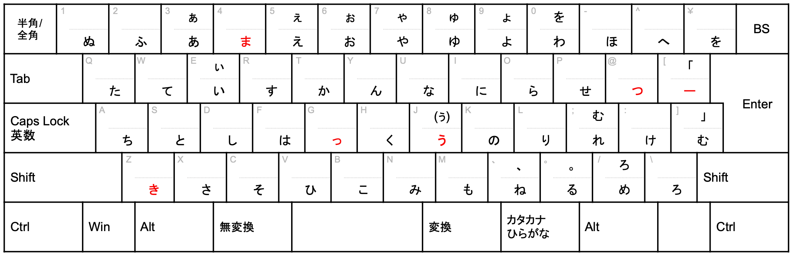
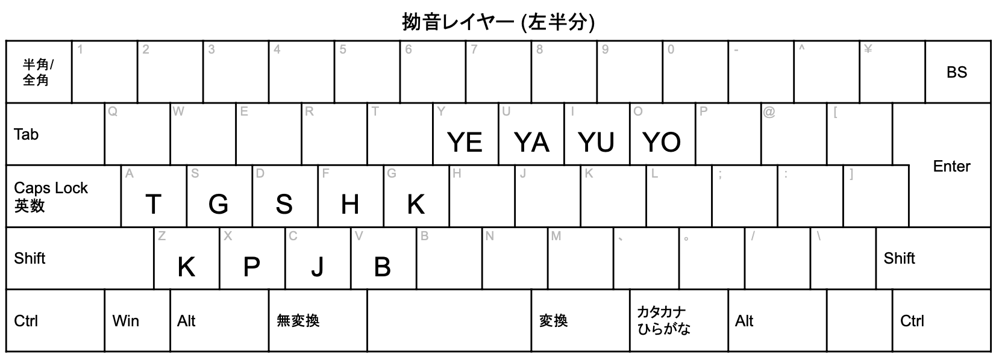
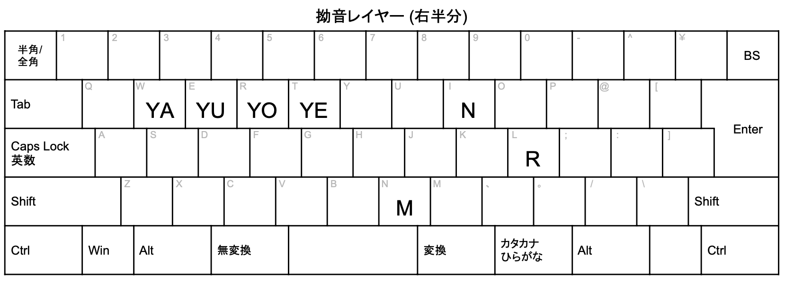

# JIS下駄配列

JIS + 新下駄 = JIS下駄配列。

- **※1**: 名前に「JIS」とありますが、JIS配列（かな入力）を元にしただけで、JISに即しているわけではありません。
- **※2**: 名前に「下駄」とあるのは、新下駄配列をベースにしていることと、新下駄配列への敬意を示しています。

## 紹介動画

https://youtu.be/lSc-KZsAjAk

## 仕様

- 中指同時シフト
  - 単打キーの左半分 + `K` = 濁音 (or 表に記載のサブ文字)
  - 単打キーの右半分 + `D` = 濁音 (or 表に記載のサブ文字)
- 薬指同時シフト
  - 単打キーの左半分 + `L` = 半濁音
  - 単打キーの右半分 + `S` = 半濁音
- 拗音レイヤー
  - 同時押しにより拗音入力。例えば「しゅ」と打つには拗音レイヤー表の「S」と「YU」を同時に打鍵。
- その他
  - 同時押し
    - `RF` or `RG` = `・`
    - `HU` = `／`
    - `FV` or `FB` = `！`
    - `NJ` = `？`
    - `FG` = `「」`
    - `HJ` = `（）`
    - `わ` + 薬指シフト = `ゎ` 
  - Shiftキー押下
    - `,` = `、` （※ 中指シフトも同様。薬指シフトは `＜`。）
    - `.` = `。` （※ 中指シフトも同様。薬指シフトは `＞`。）
    - `?` = `？` （※ 中指シフトは `ろ`。薬指シフトは `・`。）
    - `!` = `！` （※ 中指シフトも同様。薬指シフトは `？`。）
    - `_` = `＿`
    - `;` = `；` （※ 中指シフトは `む`。薬指シフトは `＋`。）
    - `:` = `：` （※ 中指シフトは `げ`。薬指シフトは `＊`。）
    - `-` = `ー` （※ 中指シフトは `ぼ`。薬指シフトは `ぽ`。）
    - `~` = `〜` （※ 中指シフトは `べ`。薬指シフトは `ぺ`。）
    - `[` = `「` （※ 中指シフトも同様。薬指シフトは `（`。）
    - `]` = `」` （※ 中指シフトも同様。薬指シフトは `）`。）
    - `う` (`J`) = `ぅ` （※ 中指シフトは `ヴ` = うの濁音。）
    - ※ やゆよ、あいうえお、わ (を) に関してはJIS配列と同じ。（v1.1.2〜）
  - 外来語
    - 一部の子音 + `え` (`5`) = `Xぇ` (`xYE`) （例えば「ふぇ」など。以下リストでは記載省略。）
    - `て` + `い` (`W` + `E`) = `ティ`
    - `た` + `い` (`Q` + `E`) = `ディ`
    - `て` + `う` (`W` + `J`) = `テュ`
    - `た` + `う` (`Q` + `J`) = `デュ`
    - `ふ` + `あ` (`2` + `3`) = `ファ`
    - `ふ` + `い` (`2` + `E`) = `フィ`
    - `ふ` + `Y` (`2` + `Y`) = `フェ` （拗音ルールと同じ。以下略。）
    - `ふ` + `お` (`2` + `6`) = `フォ`
    - `ふ` + `う` (`2` + `J`) = `フュ`
    - `う` + `い` (`J` + `E`) = `ウィ`
    - `う` + `お` (`J` + `6`) = `ウォ`
  - 英数字
    - 最上段キー + `U` (または `R`) = `１`〜`９`、`０`、`ー`、`＾`、`￥`
    - 最上段キー + `O` (または `W`) = `！`、`”`、`＃`、`＄`、...
    - （全角の`A`〜`Z`については、現時点では入力できず。※ JIS配列と同様）

 

- ※ その他細かな部分は [やまぶきR用 レイアウトファイル](./JIS下駄.yab) を参照してください。
- ※ 全ての記号や英数字が入力できるわけではないのはJIS配列（かな入力）と同じです。英数字の入力支援は一部ありますが、他のローマ字配列との併用や日本語入力システムへの辞書登録などを前提としています。（他のレイヤーが欲しい場合は、Gitでフォークして自由に亜種を作ってください。）
- ※ 説明用のシートは[こちらのスプレッドシート（閲覧専用）](https://docs.google.com/spreadsheets/d/1eEmC1SJBDk2w2HEDn1mUfNRqKU-qWRTr9UCRG0E8tx4/edit?usp=sharing)がベース。開発時はこちらを更新。（本来一緒にコミットするべきですが、Git LFSではないので当面このリンクで様子をみます。）

## 設定ファイル

※ 以下に書くTier1〜3は、更新の優先度を表します。Tier数が1から離れるほど、最新への追従やバグ修正などが遅くなります。

### Tier1

- [やまぶきR用 レイアウトファイル](./JIS下駄.yab) (※1)
- [やまぶきR用 タイピング練習用 レイアウトファイル](./JIS下駄_タイピング練習用.yab) (※1)
- [Karabiner Elements用 設定ファイル](./jis_geta.json) (※2)
- [Karabiner Elements用 タイピング練習用 設定ファイル](./jis_geta_typing_practice.json) (※2)

※1 やまぶきRは文字コードに敏感なので、動かない場合はShift-JIS等で再保存するなどしてください。 
 
※2 Karabiner Elements用ファイルは、`~/.config/karabiner/assets/complex_modifications` に配置して利用するものですが、Complex Modificationについての一般的な詳細は本ドキュメントでは割愛します。

### Tier2

- [かえうち用 設定ファイル](./JIS下駄.kaeuchi) (※3)
- [かえうち用 JSONファイル](./jis_geta_kaeuchi.json) (※3)

※3 かえうち用ファイルは、現時点では外来語支援や数字入力支援を設定していません。また、同時シフト等のアルゴリズム的に、打ちづらい場合があります。

### Tier3

（その他のソフトやプラットフォームの実装など。まだ公式には存在せず。※ フォークや他の実装等は存在する可能性はあり。）

## 特徴

- JIS配列（かな入力）から入れ替えたキーは2箇所。（ま ⇔ う、っ ⇔ き。「つ」と「ー」については廃止した濁点・半濁点の位置に配置。）
- 濁点と半濁点キーの代わりに、中指同時シフトと薬指同時シフトを採用。
- US配列でも打鍵できるよう、「む」と「ろ」については代替策を用意。
- しゃしゅしょ、にゃにゅにょ等の、新下駄配列由来の拗音入力支援および、外来語・記号の入力支援。
- 外来語・拗音については、覚えやすさを極力重視。

## 打鍵感および利点・難点

- JIS配列（かな入力）の特徴である単打が多く覚えやすいという特徴を最重視し、そこに新下駄配列由来の快適な打鍵感をプラス。
- JIS配列からの単打キーの変更箇所は大きく2箇所のみなので、JIS配列を見ながら打つこともでき、打鍵感も比較的似ているので、JIS配列（かな入力）の打鍵におけるテクニック（いわゆる最適化）をほぼそのまま転用することができる。
- 新下駄配列と違って、清濁別置ではないので、配列を覚えやすい。
    - メリット・デメリットは、基本的にJIS配列のそれを引き継ぐが、打ちにくさは緩和されている。
- 「っ/く/う」の打鍵感は新下駄配列とほぼ同じで、促音（っ）・拗音（ゃゅょ）関連の打鍵の流れは新下駄配列由来。

## 各種計測データなど

- Keyboard Layout Analyzerを使った比較: https://github.com/funatsufumiya/jisgeta_research_archive/blob/main/1.md
- 日本語キー配列アナライザーを使った比較: https://github.com/funatsufumiya/jisgeta_research_archive/blob/main/2.md
    - 記事中で使った解析器: https://funatsufumiya.github.io/keyboard_analyzer_jisgeta_static/
        - (ソースコード: https://github.com/funatsufumiya/keyboard_analyzer_jisgeta)

## 仕様の解説

### 単打面および中指・薬指同時シフト

- 赤字がJIS配列（かな入力）からの変更点を示しています。ポイントとしては、「き」と入れ替えている単打面は「つ」ではなく「っ」であることで、これは「っ/く/う」の打鍵感を新下駄配列と揃える意図があります。
- 廃止した濁音・半濁音キーに別のキーを割り当てているのは、単打で全てのかなが打鍵できることを重視しているためです。ただし、US配列でも動作させるために、「を/む/ろ」は二重に定義されています。（サブ文字は中指シフトで発動。ただし「ぅ」のみShiftキー。「う」 + 中指シフトはヴ = 「う」の濁音。）
- ~~（なお、1〜9の行のShiftキー押下については定義していませんが、JISとの互換性を上げるために今後Shiftキー押下を定義する可能性もあります。）~~
  - v1.1.2 より、Shift + 「や」 = 「ゃ」などを有効にし、JIS配列（かな入力）との互換性を上げました。これによって、拗音レイヤーは必須ではなくなり、段階的導入が可能になりました。
- 細かな仕様を見ていただけるとわかりますが、打鍵感は極力JISに近づけるよう努力しています。（特に句読点など。）
- 新下駄配列同様、連続シフトについては基本的に利用しないほうがスムーズに打鍵できるはずです。

### 拗音レイヤー

- 拗音レイヤーについては、できるだけJIS配列（かな入力）の印字面と対応するようにしています。例えば `N`(YA)、`R`(YA)、`M`(YA) は、「に」と「り」と「み」のキーにそれぞれ対応しており、`S`(YA)、`H`(YA)、`T`(YA) 、`K`(YA) は、「し」と「は」と「ち」と「き」に対応しています。
  - ほかも同様にしたかったのですが、薬指シフトと中指シフトとの兼ね合いより、避けなければならないキーがあったことも含め、濁音と半濁音は極力並ぶようにしています。（`J`(YA)と`B`(YA)は同じさ行とは行である「そ」と「ひ」など、ある程度の覚えやすさは意識しています。）
  - `K`(YA)（「き」）については、JIS配列から入れ替えていることを踏まえ、入れ替え前後の両方で同じ挙動をするように配慮しています。（印字面を見ながら打つことを想定。）
- v1.1.2より、JIS配列（かな入力）との互換性が上がったため、拗音レイヤーは必須ではなくなりました。慣れない間は従来通りの「ゃ/ゅ/ょ」等を使えますが、「う」の位置が変更になっているので少し慣れが必要かもしれません。

## Contribution & Question

- バグ報告などは随時歓迎します。動作のバグについてはGitHubにIssueを立ててください。（バグなどの動作不具合のみに限ります。）
- 利用方法の質問、リクエストなどには対応できない可能性が高いので、基本的に自力での解決（フォーク・PR等）やコミュニティによる支援を得ることになろうかと思います。
  - 一応そのために、GitHub Discussionを設けています。Issueを立てるほどではないような迷うケースでは、Discussionを使ってください。
  - Discussionに質問を投稿されても、必ず解決策が得られるというわけではないので、過度な期待はしないでください。
- PR (Pull Request) は歓迎します。Issueを先に立てていただいても構いませんし、PRを初めから作ってもらっても構いません。
  - ただしマージするとは限りません。基本的にこのリポジトリに構わず、自由にフォークしてバリエーションや亜種が複数あるほうが、Git文化的にも望ましいかなとは思います。 

## Notes

- 「JIS下駄」という名前については、他につけようがないと思っているのですが、Googlability （検索性） という意味で、検索結果としては、JIS配列上の(新)下駄配列の記事と混ざってしまっているようで、特に新下駄ユーザには申し訳ないことをしていると反省しています。（ただ、名前の変えようはないように思っています。すいません。）

- 新JIS下駄という配列も存在していたようで、新下駄配列のkouyさんが2005年に考案されていたようです: https://kouy.exblog.jp/398778/ 。 JIS + 新下駄ではなくて、新JIS + 下駄に興味のある方は参考にされてください。（ややこしいことになってすいません…。）

## License

### ベースになった配列

- [JIS配列（かな入力）](https://ja.wikipedia.org/wiki/JIS%E3%82%AD%E3%83%BC%E3%83%9C%E3%83%BC%E3%83%89) (JIS X 6002 情報処理系けん盤配列)
- [新下駄配列](https://kouy.exblog.jp/13627994/) 作者: kouyさん

### この配列（JIS下駄配列）

- MIT License / Apache License / WTFPL License のトリプルライセンス。（ただし、ベース配列の著作権にも配慮をお願いします。）
